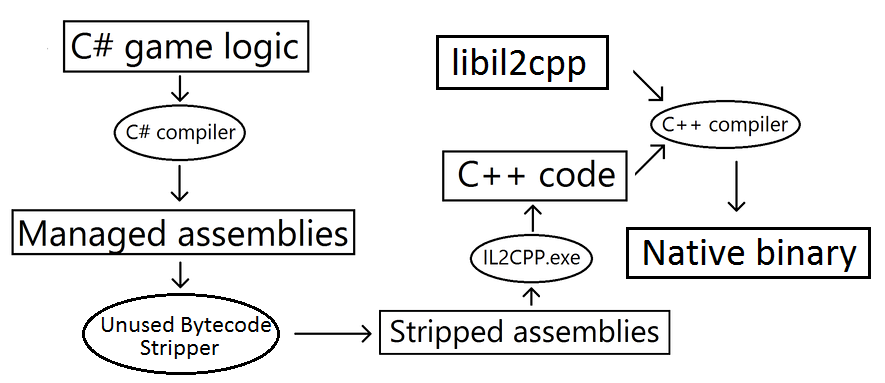

[https://docs.unity3d.com/kr/2020.3/Manual/unity-architecture.html](https://docs.unity3d.com/kr/2020.3/Manual/unity-architecture.html)

2020.3

# 유니티 닷넷 개요

유니티는 닷넷 플랫폼을 사용하여 유니티로 만든 앱이 다양한 하드웨어에서 실행할 수 있도록 한다. 

## 스크립팅 백엔드

유니티는 두 가지 스크리팅 백엔드(~~?~~)가 있고, 다른 컴파일 기술을 사용한다. 

* Mono는 JIT 컴파일을 사용하고 **런타임 시점에 요청 시 코드를 컴파일**한다. 
* IL2CPP는 AOT 컴파일을 사용하여 **실행 전에 전체 앱을 컴파일**한다. 

JIT 기반 스크립팅 백엔드를 사용할 때 AOT보다 컴파일 시간이 훨씬 빠르고 플랫폼 독립적이다. 

유니티 에디터는 JIT 기반이며 Mono를 스크립팅 백엔드로 사용한다. 빌드할 때 사용할 스크립팅 백엔드를 선택할 수 있는데, Edit -> Project Settings -> Player -> Other Settings -> Scripting Backend로 선택할 수 있다. 

### IL2CPP

IL2CPP(C++로 변환하는 중간 언어)는 유니티에서 개발한 스크립팅 백엔드로 여러 플랫폼용 프로젝트를 빌드할 때 Mono대신 사용할 수 있다. IL2CPP를 사용하여 빌드할 때 유니티가 스크립트와 어셈블리의 IL코드를 C++코드로 변환한 후 선택한 플랫폼에 적합한 네이티브 바이너리 파일을 만든다(exe, apk, xap). IL2CPP는 유니티 프로젝트의 성능, 보안 및 플랫폼 호환성 개선용으로 사용한다. 

#### 동작 방식

IL2CPP을 사용하여 빌드를 하면 다음 절차를 따른다. 

1. 유니티 스크립팅 API 코드를 닷넷 DLL(관리되는 어셈블리)로 컴파일한다.
2. 관리되는 바이트코드 스트리핑을 적용한다. 빌드된 게임의 크기를 줄인다. 
3. 모든 관리되는 어셈블리를 표준 C++로 변환한다. 
4. C++코드와 IL2CPP의 런타임 부분을 네이티브 플랫폼 컴파일러로 컴파일한다. 
5. 대상 플랫폼에 따라 실행 가능한 파일이나 DLL에 코드를 연결한다. 

  

#### IL2CPP 빌드 시간 최적화

**증분 빌드 사용**

증분 빌드를 사용하면 C++ 컴파일러가 **마지막 빌드 후에 변경된 파일만 다시 컴파일**한다. 증분 빌드를 사용하려면 프로젝트를 이전 빌드 위치에 빌드한다. 

**멀웨어 차단 소프트웨어 검사에서 프로젝트 및 대상 빌드 폴더 제외**

프로젝트를 빌드하기 전에 멀웨어 차단 소프트웨어를 비활성화하여 빌드 시간을 개선할 수 있다. **윈도우10에서 windows defender를 비활성화하면 빌드 시간이 50~66% 단축**된다!

**SSD에 프로젝트와 대상 빌드 폴더 저장**

SSD가 HDD에 비해 읽기/쓰기 속도가 더 빠르다. 

## 관리되는 코드 스트리핑

코드 스트리핑: 빌드 시 유니티는 컴파일된 어셈블리(.dll)를 스캔하여 **사용되지 않는 코드를 감지하고 제거**한다. -> 빌드 바이너리 크기를 줄이지만, 빌드 시간이 늘어난다. 

모노를 사용하면 코드 스트리핑이 비활성화되지만 IL2CPP를 이용하면 비활성화 불가능하다. 

코드 스트리핑 시 유니티의 적극성을 제어할 수 있다. 

Edit -> Project Settings -> Player -> Other Settings -> Managed Stripping Level로 선택할 수 있다. 

참고: 코드 스트리핑은 경우에 따라 너무 적극적일 수 있다. Preserve 속성과 link.xml파일을 이용하여 특정 타입 및 함수가 스트리핑되는 것을 방지할 수 있다. (~~그냥 안쓰면 날라가는 듯?~~)

## 가비지 컬렉션

유니티는 Mono, IL2CPP 모두 **Boehm 가비지 컬렉터**(~~?~~)를 사용한다. 유니티는 기본적으로 Incremental 모드이고 이를 권장하지만 stop the world방법도 사용할 수 있다. 

Edit -> Project Settings -> Player -> Other Settings -> Use Incremental GC 체크박스 전환

Incremental 모드는 **제한된 시간 동안에만 실행되며, 모든 오브젝트를 반드시 한 번에 수집하지는 않는다**. 이렇게 하면 오브젝트 수집에 걸리는 시간이 여러 프레임에 걸쳐 분산되고 불안정한 현상 & CPU 스파이크가 줄어든다. 

CPU 스파이크 가능성을 확인하려면 유니티 프로파일러를 사용하자. 또한 가비지컬렉터 API를 이용하여 가비지 컬렉션을 완전히 비활성화할 수 있다. 

### 자동 메모리 관리 이해

오브젝트나 문자열, 배열을 생성후 저장하려면 힙 공간에서 필요한 공간이 할당된다. 메모리 공간을 할당받은 항목이 더 이상 사용되지 않다면 차지하는 메모리를 회수하여 다른 학목을 저장하는 데 사용한다. 이전에는 **명시적으로 회수**했지만, 최근에는 **자동으로 메모리를 관리**한다. 자동으로 메모리를 해제하여 코딩량을 낮추고 메모리 누수 현상 발생 가능성을 낮춘다. 

#### 값 타입과 레퍼런스 타입

함수가 호출되면 **하위 파라미터의 값이 해당 함수 호출을 위해 지정된 메모리 구역에 복사**된다. 몇 바이트만 차지하는 데이터 타입은 빠르고 쉽게 복사되지만, 보통 오브젝트, 문자열, 배열은 이보다 더 큰 경우가 많다. 따라서 이를 주기적으로 복사하는 것은 비효율적이므로 **실제 저장 공간은 힙에 할당**되고 이 **저장 위치를 기억하는 작은 포인터 값이 사용**된다. 런타임 시스템이 포인터가 식별하는 항목을 찾을 수 있는 경우 데이터를 한 번만 복사해도 여러 번 사용이 가능하다. 

값 타입은 **파라미터가 전달되는 동안 사본이 직접 저장되는 타입**이다. 이런 타입으로 정수, 부동소수점, 부울, 유니티의 구조체 타입(Color, Vector3)가 포함된다. 반면 포인터로 엑세스되는 타입은 레퍼런스 타입이라 하며 **변수에 저장되는 값은 실제 데이터를 참조**한다. 

#### 메모리 할당 및 가비지 컬렉션

**메모리 관리자는 힙에서 사용되지 않는 영역을 트레킹**한다. 오브젝트가 인스턴스화되는 것 같이 메모리 블록이 요청된다면, 관리자는 블록을 할당하기 위해 미사용 영역을 선택하고 할당된 메모리를 제거한다. 이 과정은 필요한 블록 크기를 할당할 수 없는 빈 공간이 없을 때까지 반복한다. 이 시점에 힙에 할당된 모든 메모리가 사용 중일 가능성은 매우 낮다. 힙의 참조 항목을 접근하려면 해당 항목을 찾을 수 있도록하는 참조 변수가 필요하다. 참조 변수가 재할당되거나 로컬 변수로 변하는 경우와 같이 메모리 블록에 대한 모든 참조가 사라진 경우 해당 메모리 블록을 안전하게 제할당할 수 있다(~~안전하게 지울 수 있다는 말인가?~~). 

**어떤 힙 블록의 사용유무를 파악하기 위해 메모리 관리자는 모든 액티브 잠조 변수를 검색하고, 이 변수가 참조하는 블록을 살아있음(live)이라고 표시**한다. 검색이 끝나면 메모리 관리자는 **살아있는 블록 사이의 모든 공간을 비어 있다고 간주**하고 다음 할당 요청시 사용할 수 있는 것으로 간주한다. 이렇게 미사용 메모리를 파악하고 해제하는 프로세스를 가비지 컬렉션이라 한다. 

유니티는 stop-the-world 방식의 가비지 컬렉터인 Boehm-Demers-Weiser 가비지 컬렉터를 사용한다. 가비지 컬렉션을 실행할 때 프로그램 코드 실행을 중지하고 가비지 컬렉터가 모든 작업을 마친 후에 일반적인 실행을 재개한다. **이런 중단으로 게임 내 실행에 지연이 발생**할 수 있다. 지연 시간은 1밀리초 이하에서 수백 밀리초에 이르기까지 다양하다. 게임의 경우, 가비지 컬렉터가 동작하면 부드러운 애니메이션을 구현하는 데 일관된 프레임 속도를 지속할 수 없다. 이런 중단 문제는 프로파일러 프레임 시간 그래프에서 높게 치솟은 모양을 보인다고 해서 **GC스파이크**라 불린다. 

#### 최적화

가비지 컬렉션(GC)은 자동으로 일어나고 프로그래머에게 비가시적으로 일어나지만, 상당한 CPU 시간을 요구한다. 제대로 사용하면 자동 메모리 관리는 전반적으로 수동 할당과 비슷하거나 그 이상의 결과를 나타낸다. 그러나 **GC가 필요 이상으로 호출되어 게임이 실행 중 멈추는 현상을 조절하는 것이 중요**하다. 

다음의 예는 GC의 악몽을 불러올 수 있는 알고리즘이다. 

```cs
//C# script example
using UnityEngine;
using System.Collections;

public class ExampleScript : MonoBehaviour {
    void ConcatExample(int[] intArray) {
        string line = intArray[0].ToString();
        
        for (i = 1; i < intArray.Length; i++) {
            line += ", " + intArray[i].ToString();
        }
        
        return line;
    }
}
```

위 코드에서 루프가 실행될 때마다 라인 변수의 이전 내용이 삭제되고, 기존 조각 끝에 새로운 부분이 더해진 형태의 새로운 문자열이 할당된다. i가 커질수록 힙 공간 역시 증가한다. 이렇게 **문자열을 동시에 여러 개 연결하는 경우**, Mono 라이브러리의 **System.Text.StringBuilder** 클래스를 이용하는게 좋다. 

그러나 문자열 연결이 반복되도 지나치게 자주 호출되지만 않으면 큰 문제는 없다. 예를 들어 아래처럼 프레임 업데이트마다 문자열 연결을 반복하지만 않으면 된다. 

```cs
using UnityEngine;
using UnityEngine.UI;
using System.Collections;

public class ExampleScript : MonoBehaviour {
    public Text scoreBoard;
    public int score;
    
    void Update() {
        string scoreText = "Score: " + score.ToString();
        scoreBoard.text = scoreText;
    }
}
```

업데이트가 호출될 때마다 지속적으로 메모리를 생성한다. 대부분의 메모리 누수는 score가 변경될 때만 텍스트를 업데이트하여 줄일 수 있다. 

```cs
using UnityEngine;
using UnityEngine.UI;
using System.Collections;

public class ExampleScript : MonoBehaviour {
    public Text scoreBoard;
    public string scoreText;
    public int score;
    public int oldScore;
    
    void Update() {
        if (score != oldScore) {
            scoreText = "Score: " + score.ToString();
            scoreBoard.text = scoreText;
            oldScore = score;
        }
    }
}
```

다른 문제는 어떤 함수가 배열 값을 반환하는 경우이다. 

```cs
using UnityEngine;
using System.Collections;

public class ExampleScript : MonoBehaviour {
    float[] RandomList(int numElements) {
        var result = new float[numElements];
        
        for (int i = 0; i < numElements; i++) {
            result[i] = Random.value;
        }
        
        return result;
    }
}
```

이 함수 타입은 값으로 채워진 배열을 생성하는 데 매우 편리하지만 자주 호출하면 매번 새로운 메모리가 할당된다. 배열은 보통 크기가 상당히 커 빈 힙공간을 빠르게 소비하므로 자주 가비지 컬렉션을 해야 한다. 

배열이 참조 타입이라는 점을 활용하여 해결할 수 있다. **함수에 파라미터로 전달된 배열은 해당 함수에서 수정할 수 있으며 수정 결과는 함수를 리턴해도 유지**된다. 이 점을 이용하여 아래처럼 수정할 수 있다. 

```cs
using UnityEngine;
using System.Collections;

public class ExampleScript : MonoBehaviour {
    void RandomList(float[] arrayToFill) {
        for (int i = 0; i < arrayToFill.Length; i++) {
            arrayToFill[i] = Random.value;
        }
    }
}
```

#### 가비지 컬렉션 비활성화

Mono또는 IL2CPP 스크립팅 백엔드를 사용하는 경우 런타임 시 GC를 비활성화하여 GC스파이크를 막을 수 있다. GC를 비활성화하면 메모리 사용량이 **절대로** 감소하지 않는다. 실제로, GC를 비활성화하면 계속 메모리 사용이 증가하므로 잘 관리해야 한다. 이상적으로는 GC를 비활성화하기 전 모든 메모리를 할당하고 비활성화된 시간 동안, 추가 할당을 피하는게 좋다. 

#### 컬렉션 요청

할당을 최소화하는 것은 좋지만 완전히 제거하는 것은 불가능하므로 아래와 같은 전략을 사용한다. 

**작은 힙과 빠르고 빈번한 가비지 컬렉션**

**오래 플레이되는 게임에서 부드러운 프레임 유지를 위해 적합**하다. 이런 게임은 작은 블록을 자주 할당하지만, 짧은 기간동안 사용된다. 이 방법을 ios에서 사용할 때 힙 크기는 200KB이며, GC는 iPhone 3G에서 대략 5ms가 걸린다. 힙 크기가 1MB로 증가하면 GC는 7ms 정도 걸린다. 따라서 GC를 일정 프레임 간격마다 주기적으로 요청하는게 좋다. 이렇게 하면 GC를 필요이상으로 실행하게 되지만 더 빠르게 수행되어 게임플레이에 최소한의 지장만 주게 된다. 

```cs
if (Time.frameCount % 30 == 0)
{
   System.GC.Collect();
}
```

그러나 이 기법은 주의해서 사용해야 하고 실제 가비지 컬렉션 시간을 감소시키는지 프로파일러 통계를 확인해야 한다!

**큰 힙과 느리지만 덜 빈번한 가비지 컬렉션**

**메모리 할당과 가비지 컬렉션이 자주 발생하지 않아 게임플레이 중간에 처리할 수 있는 게임에 적합**하다. 힙 용량은 최대한 큰 것이 좋다. 다만, 너무 커서 OS가 메모리 확보하다 강제 종료되는 경우는 피해야 한다. Mono 런타임은 자동으로 힙을 확장하는 것을 최대한 피한다. 따라서 수동으로 힙을 확장해야 하는데, 시**작할 때 미리 플레이스홀더를 만들면 된다**. 

```cs
using UnityEngine;
using System.Collections;

public class ExampleScript : MonoBehaviour {
    void Start() {
        var tmp = new System.Object[1024];
        
        // make allocations in smaller blocks to avoid them to be treated in a special way, which is designed for large blocks
        for (int i = 0; i < 1024; i++)
            tmp[i] = new byte[1024];
        
        // release reference
        tmp = null;
    }
}
```

충분히 큰 힙을 확보하면 힙이 차버려서 가비지 컬렉션이 일어나는 일이 발생하지 않는다. 일시정지가 발생하면 명시적으로 가비지 컬렉션을 요청할 수 있다. 

**그리고 이런 전략을 이용할 때는 효과가 있을 것으로 막연히 기대하지말고 프로파일러로 확인하자**.

**재사용 가능 오브젝트 풀**
새로 생성되고 제거되는 오브젝트의 수를 줄이는 것으로 간단하게 가비지 생성을 줄일 수 있다. 투사체의 경우 여러 번 반복되지만 한 번에는 몇 개만 사용되는 오브젝트 유형이 있다(~~?~~). 이런 경우 오브젝트를 새로 생성하여 기존 오브젝트를 대체하는 것보다 오브젝트를 재사용하는 것이 좋다. 

### 점진적 가비지 컬렉션

점진적 가비지 컬렉션: **가비지 컬렉션 프로세스를 여러 프레임에 분산하는 것**.

유니티의 기본 GC 방식이다. 여전히 Boehm-Demers-Weiser GC지만, 점진적 모드인게 다르다. 실행할 때마다 전체 GC를 수행하는 것이 아닌, 여러 프레임에 걸쳐 작업량을 분할한다. 따라서 여러 번에 걸쳐 짧은 시간 동안만 프로그램을 중단한다. 이렇게 하면 컬렉션 속도를 향상시키진 않지만, 앱의 실행을 방해하는 GC 스파이크를 줄인다. 

이런 방식을 이용하면 일관된 프레임 속도를 유지할 수 있다. 

또한 프로젝트의 품질 설정에서 VSync Count를 Don't Sync 이외 옵션으로 선택하거나 Application VSync 프로퍼티 또는 Application.targatFrameRate 프로퍼티를 활성화하면 유니티는 특정 프레임이 끝날 때까지 대기 상태 시간을 점진적 가비지 컬렉션에 자동으로 사용한다(~~뭔말이지?~~).

점진적 가비지 컬렉션 동작을 정밀하게 제어하는 경우 Scripting.GarbageCollector 클래스를 사용할 수 있다. 예를 들어 VSync 또는 타겟 프레임 속도를 사용하고 싶지 않으면 프레임이 끝나기 전에 직접 이용 가능한 시간을 계산한 후 해당 값을 GC에 제공하여 사용하게 만들 수 있다(~~?~~).

#### 저진적 GC에서 발생할 수 있는 문제

점진적 GC는 작업량을 나눌 때 마킹 단계(~~?~~)를 분할한다. 이 단계에서 모든 관리되는 오브젝트를 스캔하여 사용중인 오브젝트와 정리할 오브젝트를 판단한다. 마킹 단계 분할은 오브젝트 사이에 있는 레퍼런스 대다수가 작업 조각 사이에서 변하지 않을 때 특히 유용하다. 오브젝트 레퍼런스가 변경되면 해당 오브젝트는 다음 반복 작업 때 다시 스캔해야 한다. 따라서 변경사항이 너무 많다면 점진적 GC에 과부하가 걸릴 수 있다. 따라서 처리해야 할 작업이 너무 많아서 마킹 패스가 완료되지 않는다. 이 경우 GC는 비점진적 컬렉션으로 풀백한다. 

점진적 GC를 사용한다면 유니티는 추가 코드를 생성하여 레퍼런스가 변경될 때마다 GC에게 알려야 한다. 그래야만 GC가 오브젝트를 스캔할지 판단할 수 있다. **레퍼런스가 변경될 때 오버헤드가 추가로 발생**한다. 

### 프로파일러

Windows -> Analysis -> Profiler

## 닷넷 시스템 라이브러리

닷넷 시스템 라이브러리는 경우에 따라 플랫폼별 구현이 필요하다. 유니티는 **모든 버전에서 닷넷 시스템 라이브러리의 성능 또는 할당을 보장하지 않는다.** 

JIT 스크립팅 백엔드를 사용하면 애플리케이션 런타임 중 동작 C# 닷넷 IL 코드 생성을 구현할 수 있지만, AOT 스크립팅 백엔드는 동적 코드 생성을 지원하지 않는다. **타사 라이브러리를 사용할 경우 이런 점을 고려해야 한다**. 타사 라이브러리의 경우 JIT, AOT에 대해 서로 다른 코드 경로를 사용하거나, 동적으로 생성된 코드에 의존하는 코드 경로를 사용할 수 있기 때문이다. 

유니티는 다양한 닷넷 API를 지원하지만, 다음과 같은 이유로 **신규 프로젝트에 닷넷 스텐다드 2.0 API호환성 레벨을 사용**해야 한다. 

1. 최종 실행 파일의 크기가 작다.
2. 크로스 플랫폼 지원이 뛰어나다.
3. 모든 닷넷 런타임에서 지원하므로, 더 많은 VM/런타임 환경에서 코드가 작동한다. 
4. 닷넷 스텐다드는 컴파일 시간으로 더 많은 오류를 이동(~~?~~)시킨다. 

## 타사 닷넷 라이브러리 사용

타사 라이브러리 사용 시 다음을 검토하자. 

1. 호환성: 타사 라이브러리는 일부 유니티 플랫폼 및 스크립팅 백엔드와 호환되지 않을 수 있다. 
2. 성능: 타사 라이브러리는 다른 닷넷 런타임 대비 유니티의 성능 특성이 크게 다를 수 있다. 
3. AOT 바이너리 크기: 타사 라이브러리는 라이브러리가 사용하는 종속성 개수로 인해 AOT 바이너리 크기가 크게 늘어날 수 있다. 

## C# 반사 오버헤드

Mono 및 IL2CPP는 모든 C# 반사(System.Reflection) 오브젝트를 내부적으로 캐싱하며, 유니티는 오브젝트에 대해 GC를 수행하지 않는다. GC가 반사 오브젝트를 지속적으로 스캔하여 매우 큰 GC 오버헤드가 발생할 수 있기 때문이다. 

**GC 오버헤드를 최소화하려면 애플리케이션에서 Assembly.GetTypes 및 Type.GetMethods()와 같은 메서드를 피해야** 한다. 이런 메서드는 런타임 시점에 C# 반사 오브젝트를 생성한다. 

## UnityEngine.Object 특수 동작

UnityEngine.Object은 유니티의 특수 타입 C# 오브젝트로 네이티브 C++ 카운터파트 오브젝트(~~C#과 Cpp에서 서로 동일시되는 객체?~~)에 연결되어 있다. Camera 컴포넌트를 쓰는 경우, 유니티는 오브젝트의 상태를 C# 오브젝트가 아니라 **네이티브 C++ 카운터파트에 저장**한다. 

### 중요 클래스 - Object

Object라 불리는 클래스는 에디터에서 참조할 수 있는 모든 오브젝트의 기본 클래스 역할을 한다. UnityEngine.Object에서 상속되는 클래스는 인스펙터의 필드로 드래그엔 드롭, 오브젝트 필드 옆에 있는 오브젝트 피커를 사용하여 선택할 수 있는 특수 기능을 제공한다.

자체 오브젝트를 스크립팅을 통해 생성하는 경우, Object에서 직접 상속하지 않고 목표에 맞게 설계된 클래스에서 상속해야 한다. 게임 오브젝트에 추가할 커스텀 컴포넌트, 게임 오브젝트의 기능 제어, 일부 관련 기능 제공의 경우에 MonoBehaviour에서 상속해야 한다. 직렬화된 데이터를 저장할 수 있는 커스텀 에셋을 생성하려면 ScriptableObject에서 상속해야 한다. 

두 가지 모두 Object클래스에서 상속하지만, 해당 목적에 적합한 추가 기능을 제공한다. 

유니티의 Object 클래스는 GameObject, COmponent, Material, Texture, Mesh, Sprite 등을 비롯한 대부분의 유니티 빌트인 클래스에 대한 기본 클래스 역할을 한다. 

## 유니티 C# 및 유니티 C++가 공유하는 UnityEngine 오브젝트

Object.Destroy or Object.DestroyImmediate 등과 같은 메서드를 이용하여 unityEngine.Object 파생 오브젝트를 파괴하면 유니티는 네이티브 카운티 오브젝트를 파괴한다. GC가 메모리를 관리하므로 명시적으로 C#오브젝트를 파괴할 수 없다. GC가 수집 후 파괴한다. 

파괴된 UnityEngine.Object에 다시 엑세스하면 유니티는 대부분의 타입에 대한 네이티브 카운터파트 오브젝트를 다시 생성한다. 한편 두 가지 예외로 MonoBehaviour와 ScriptableObject가 있는데 유니티는 파괴된 오브젝트를 다시 로드하지 않는다. 

위의 두 경우는 같음(==) and 같지 않음(!=) 연산자를 오버라이드한다. 따라서 파괴된 MonoBehavour나 ScriptableObject에 이러한 연산자를 사용하는 경우, **같음 및 같지 않음 연산자와 동일한 결과를 반환하지 않는다.**

(~~모노비헤이비어의 비교 연산은 일반적인 == 연산의 한계로 오브젝트 생성 시 자동으로 할당되는 GUID를 비교하는 것으로 대체된다~~)

## async 및 await 사용 지양

유니티 API는 스레드에 안전하지 않으므로 async 및 await을 쓰지 않도록 한다. 