빌드 실행 순서 -> **3.2.로**


# 1. 컨테이너 첫걸음

## 1.1. hello-world 실행

```
docker run hello-world
```

실행시 나오는 메세지를 번역해보면 다음과 같다. 

  

  

1~4의 내용을 확인해보자. 

1. 터미널 혹은 커맨드 프롬프트에서 'docker run hello-world'를 실행하면 도커 데몬에 접속. 도커의 공식 문서에는 데몬을 엔진이라 부르기 때문에 엔진이란 표현을 사용. 
2. 커맨드 중 hello-world는 리포지터리의 이름임. 도커 엔진은 도커 허브의 리포지터리로부터 컨테이너를 위한 이미지를 로컬에 다운로드
3. 도커 엔진이 이미지로부터 컨테이너를 생성. 컨테이너상의 프로세스가 메시지를 표준 출력에 쓰기 시작.
4. 도커 엔진은 컨테이너의 표준 출력을 도커 커맨드에 보내고 터미널에 표시

이미지: 운영체제와 소프트웨어를 담는 컨테이너 실행 이전 상태

리포지터리: 이미지의 보관장소

레지스트리: windows의 설정 정보 DB를 말하기도 하지만, 도커에서는 리포지터리의 집합체로서 리포지터리를 제공하는 서버를 말함

## 1.2. 컨테이너의 생명 주기와 도커 커맨드

컨테이너는 세 가지 상태를 가짐. 

컨테이너 상태의 종류
1. 이미지
2. 실행
3. 정지

  

각 상태 전이를 확인해보자. 

**1. 이미지 다운로드**

`docker pull 리포지터리명[:태그]`를 실행하면 원격 리포지터리로부터 로드한다. 

  

**2. 컨테이너 실행**

명령어에서 `docker run [옵션] 리포지터리명:태그 [커맨드] [인자]`는 지정한 이미지를 모형으로 컨테이너를 가동한다. 로컬에 없으면 원격에서 가져오는데 기본값 원격 리포지터리는 도커 허브이다. 

  

  

**3. 컨테이너 상태 출력**

커맨드 `docker ps [옵션]`은 실행, 정지상태의 컨테이너 목록 출력. 옵션을 생략하면 실행 중인 컨테이너만 출력. `-a`를 추가하면 정지도 출력

  

**4. 로그 출력**

정지 상태인 컨테이너는 삭제까지 남아있으며, 실행 중 발생한 표준 출력과 표준 에러 출력을 간직한다. `docker logs [옵션] 컨테이너ID | 컨테이너명`으로 확인할 수 있다. 

**5. 컨테이너 정지**

실행중인 컨테이너를 다음과 같이 정지할 수 있다.
`컨테이너의 PID=1인 프로세스가 종료한다.`
`docker stop 컨테이너너ID | 컨테이너명`
`docker kill 컨테이너ID | 컨테이너명`

*책 예시가 뭔가 이상하네요. rm 써놓고 kill이라 하네요... p.117*

**6. 컨테이너 재기동**

정지 상태인 컨테이너를 `docker start [옵션] 컨테이너ID | 컨테이너명` 으로 재기동 가능(*그런데 해보니까 attach가 되던데...*)

**7. 컨테이너 변경사항 리포지토리 저장**

기동한 컨테이너의 리눅스에서도 가상 서버처럼 필요한 패키지를 설치하거나 업데이트 할 수 있다. 

`docker commit [옵션] 컨테이너ID | 컨테이너명 리포지터리명[:태그]`

컨테이너의 상태를 이미지로 만들어 리포지터리에 보관 가능

  

**8. 이미지를 원격 리포지터리에 보관**

도커 허브를 사용하는 경우
1. 도커 허브에 가입하여 도커 ID를 취득
2. 명령어에 `docker login`으로 ID와 비밀번호 입력하여 로그인
3. 명령어 `docker tag`로 로컬 이미지에 태그 부여
4. 명령어 `docker push`로 이미지를 원격에 업로드
5. 도커 허브에서 확인

  

  

  

**9. 종료 컨테이너 제거**

`docker rm 컨테이너ID | 컨테이너명`

**10. 필요 없어진 이미지를 로컬 리포지토리에서 삭제**

`docker rmi 이미지ID`

## 1.3. 마무리

* 도커 커맨드는 백그라운드에서 돌고 있는 도커 엔진에 명령어를 주어 실행 
* 컨테이너를 실행하기 위해 리눅스 커널이 필요. 맥 윈도우는 가상 머신의 리눅스에서 컨테이너 실행
* 도커 엔진은 docker 커맨드의 요청으로 원격 리포지터리에서 이미지를 다운로드하고 컨테이너를 생성하여 실행하고 애플리케이션의 입출력을 터미널에서 연결하는 역할을 수행

***

# 2. 컨테이너 다루기

## 2.1. 대화형 모드로 컨테이너 기동 정지

### 2.1.1. 대화형 모드로 컨테이너 기동(docker run -it)

대화형 모드로 컨테이너를 기동하기 위해서 다음으로 실행 

`docker run -it 리포지터리명:[태그] 셸`

* -i: 키보드 입력을 표준입력으로 셸에 전달

* -t: 유사 터미널 디바이스(pts)에서 셸을 연결

-it를 이용하면 셸은 터미널과 접속되어있다고 인식하고 셸의 프롬프트를 출력. `root@abcdef...`과 같이 프롬프트가 출력되는데, `abcdef...` 부분이 컨테이너의 호스트이자 ID.

--name 옵션을 이용하면 컨테이너 이름을 지정해서 컨테이너ID 대신 편하게 사용할 수 있다. 

### 2.1.2. 대화형 모드에서 컨테이너 정지

exit를 입력하면 컨테이너를 종료할 수 있다. 


우분투 컨테이너 실행: `docker run -it ubuntu bash`

centos 컨테이너 실행: `docker run --name centos centos:7 bash`

## 2.2. 컨테이너 조작 및 이미지 작성

목표: 레지스트리에 등록된 공식 이미지 우분투와 centos 기동 후 소프트웨어 패키지를 설치한 뒤 이미지 보존하기

실행 중 컨테이너는 IP 주소를 할당받고 이를 바탕으로 컨테이너 간 통신을 수행.

우분투는 apt, centos는 yum사용

컨테이너에 패키지 설치(우분투): `apt-get update && apt-get install -y iputils-ping net-tools iproute2 dnsutils curl`

컨테이너에 패키지 설치(centos): `yum update -y && yum install -y iputils-ping net-tools iproute2 dnsutils curl`

컨테이너를 이미지로 만들어 보관: `docker commit centos my-centos:0.1`

**실행한 컨테이너로 이미지를 많이 만드는 것이 좋을까?**

> 무조건 그렇지는 않다. 왜냐하면 어떤 앱이 설치되었는지 확인하기 어렵기 때문

실행중인 컨테이너의 IP주소는 도커 커맨드로 확인이 가능: `docker inspect [옵션] 컨테이너ID | 컨테이너명`

## 2.3. 여러 터미널에서 조작

2개 이상의 터미널에서 접속하려면? 

`docker exec -it 컨테이너명 bash`

리눅스 서버는 w명령어로 동시에 로그인한 다른 유저 정보를 얻음. 그러나 컨테이너에서는 w커맨드 입력해도 아무것도 나오지 않음. 

이유는 컨테이너에는 로그인을 통한 유저 인증 기능이 없고, 유저 자체를 관리하지 않기 때문. 

tty: 사용중인 터미널 출력

ps ax: 모든 프로세스 목록 출력

## 2.4. 호스트와 컨테이너의 관계

호스트: 컨테이너를 실행하는 리눅스 서버

터미널 1

  

터미널 2

  

터미널 3

  

이 사실로 알 수 있는 것은 컨테이너의 실체가 프로세스라는 것이다(*갑자기?*). 

*이부분 이해가 안가네요. 왜 갑자기 컨테이너가 프로세스라는건지...*

*확인. wsl에서 확인해보니까 프로세스로 뜨네요.*

## 2.5. 마무리

* 컨테이너를 사용하면 마치 가상 서버에 로그인한 것처럼 셸을 사용하여 명령어를 내릴 수 있음 
* 컨테이너를 여러 개 기동하면 분리된 가상 서버인 것처럼 독립적으로 사용할 수 있음
* 컨테이너는 IP주소를 가지며 호스트의 다른 컨테이너와 통신할 수 있음
* `docker commit`명령어를 통해 컨테이너를 이미지로 만들어 보관 가능
* 리눅스는 멀티유저용이지만 컨테이너는 단일 유저용
* 의도적으로 포트를 열지 않는 이상 외부에서 컨테이너에 접속할 수 없음
* 컨테이너는 호스트의 커널을 공유하는 리눅스 프로세스(왜?)

***

# 3. 컨테이너 개발

## 3.1. 이미지 빌드 개요

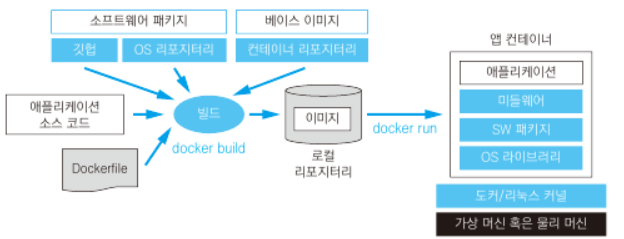  

이미지를 만드는 과정. 이미지를 만들기 위해서는 `docker build [옵션] 경로 [url] -` 을 이용.

**1. 베이스 이미지 선택**

베이스이미지: 이미지의 바탕이 되는 이미지

**2. 소프트웨어 패키지 설치**

apt, yum을 이용해서 설치 or 프로그래밍 언어인 경우 패키지매니저를 이용

뒤에서는 이를 Dockerfile로 스크립트 형식으로 설치가 가능

**3. 애플리케이션 소스 코드**

깃헙 혹은 로컬에 있는 소스 코드를 이미지에 복사

**4. Dockerfile**

이미지를 빌드하는 스크립트가 기재된 파일. 다음의 정보를 갖는다. 

1. 베이스 이미지 리포지터리
2. 설치할 패키지
3. 애플리케이션 코드와 설정 파일
4. 컨테이너 기동 시 실행될 명령어

## 3.2. 빌드 실행 순서

**실행 흐름의 5단계**

1. 디랙터리 준비. 이미지에 포함할 파일을 모은다.
2. Dockerfile작성
3. 컨테이너에서 실행할 애플리케이션 코드 작성 & 유닛 테스트
4. 이미지 빌드
5. 컨테이너 실행 및 동작 확인

**목표: message라는 이름의 파일에 있는 문자열을 아스키 아트로 변환하여 툴력하는 컨테이너 제작**

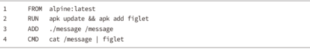  

```
FROM alpine:latest
RUN apk update && apk add figlet
ADD ./message /message
CMD cat /message | figlet
```

1. FROM으로 베이스 이미지를 지정. 도커 허브에서 다운로드
2. RUN apk update && apk add figlet: 컨테이너에서 실행할 명령어 지정. apk 업데이트, figlet설치
3. message를 message로 복사
4. CMD로 컨테이너가 기동한 직후 실행되는 커맨드 지정

이후 빌드를 하자. `docker build --tag 리포지토리명[:태그] 경로`를 실행하면 된다. 

* 주의점: 현재 디랙토리에서 하는 경우 . 앞에 빈칸 추가하기, 이미지는 대문자 안됨.

## 3.3. 도커파일 작성법

자주쓰는 커맨드

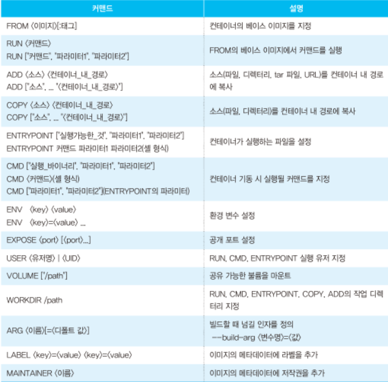  

## 3.4. DOckerfile 작성 모범 사례

짧게 사는 컨테이너를 만들어라. 

기존 오케스트레이션 도구: 멱등성에 기초

도커의 경우: 컨테이너를 기동/교체/종료 가능. 이미지만 고정

컨테이너의 특징
1. 프로젝트에 새롭게 참가한 개발자가 개발 및 실행 환경에 대해 학습해야할 시간과 노력을 줄여줌
2. 소프트웨어 의존 관계를 컨테이너에 담아 실행 환경 사이의 이동을 쉽게함
3. 서버, 시스템 관리 부담을 줄임
4. 개발 환경과 운영 환경의 차이를 줄여 지속적 개발 릴리즈를 쉽게 함
5. 같은 이미지를 사용하는 컨테이너를 늘려 쉽게 처리능력을 높임

* 작성 모범 사례
[https://docs.docker.com/develop/develop-images/dockerfile_best-practices/](https://docs.docker.com/develop/develop-images/dockerfile_best-practices/)

## 3.5. 마무리

* 이미지를 빌드하려면 디렉터리를 만들고 포함할 파일을 모아야 함
* 디렉터리에 Dockerfile을 만들고 docker build
* Dockerfile에서는 from으로 베이스 이미지 지정, run으로 스크립트 실행, add로 컨테이너 안의 파일이나 디렉터리 추가, cmd로 컨테이너 기동 시 실행할 명령어 지정
* 빌드 완료되면 --tag옵션을 이용하여 지정한 이름으로 로컬 리포지토리에 저장

***

# 4. 컨테이너와 네트워크

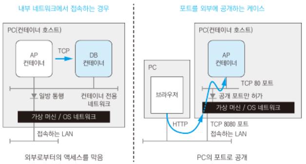  

왼쪽: 호스트 내에서 접근 가능한 전용 네트워크를 통해 애플리케이션과 데이터베이스를 연결하는 것.
오른쪽: 컨테이너를 호스트의 외부 네트워크에 공개하는 것

## 4.1. 컨테이너 네트워크

도커 허브에 등록된 많은 애플리케이션들이 --link를 사용해 컨테이너를 연동할 것을 안내하고 있음(18년 기준). 그런데 `docker network`사용을 권고하라고 되어 있음

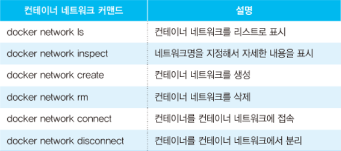  

컨테이너 네트워크 출력

`docker network ls`

DRIVER 옆에 있는 값이 bridge인 경우 외부 네트워크와 연결되어 있는 네트워크. 이 네트워크에 연결된 컨테이너는 외부의 리포지터리에 접근 가능.

네트워크에 연결된 컨테이너는 `-p`옵션으로 외부에 포트를 공개할 수 있음. 컨테이너 기동시 명시적으로 네트워크를 지정하지 않으면 이 네트워크에 연결됨. 

*뭔말이죠?*

*컨테이너와 컨테이너 네트워크는 독립적이다*

컨테이너 네트워크 만들기: `docker network create 네트워크명`

컨테이너를 기동할 때 `docker run`에 커맨드 옵션으로 `--network my-network(네트워크 이름)`을 지정하면 my-network에 연결된 컨테이너가 기동됨. **이렇게 기동된 컨테이너는 같은 네트워크에 연결된 컨테이너와만 통신이 가능**

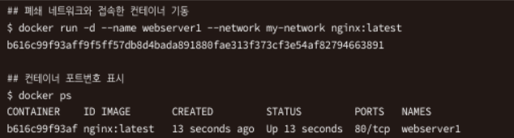  

컨테이너를 기동하여 nslookup으로 컨테이너 이름에 대한 IP주소를 검사하고 curl로 HTTP요청을 전송하기

`docker run -it --rm --name net-tool --network my-network my-ubuntu:0.1 bash`

```
## 내부 DNS 주소 해결 테스트
nslookup webserver1

## HTTP 접속 테스트
curl http://webserver1
```

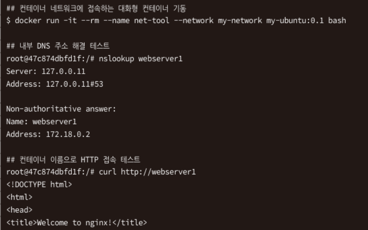  

*안되는데?*

한편, bridge에 연결된 컨테이너는 nslookup으로 webserver1의 도메인 이름 분석에 실패한다. 

`docker run -it --rm --name net-tool --network bridge my-ubuntu:0.1 bash`

```
## 내부 DNS 주소 해결 테스트
nslookup webserver1

## HTTP 접속 테스트
curl http://webserver1
```

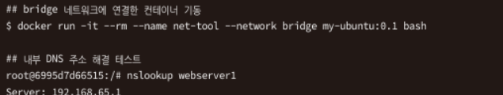  
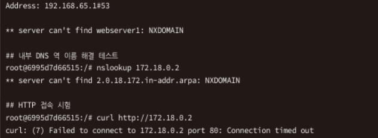  

*이 챕터는 아예 이해가 안되네요. 우선 webserver1이 조회가 안되구요. 그리고 브리지 네트워크도 driver가 브리지고 my-network도 설정을 건들지 않으면 bridge로 나오는데 책이 뭔소리를 하는지 잘 모르겠습니다.*

*해결: my-ubuntu 이미지로 net-tool 컨테이너를 띄우고, nginx:latest 이미지로 webserver1을 띄울 때, net-tool의 네트워크의 name이 bridge일 때는 안되고 my-network일 때는 됨. 이유는 동일 네트워크 사용 여부에 따라 갈림*

## 4.2. 외부에 포트 공개

컨테이너 기동시 

`docker run [옵션] 리포지터리[:태그] 커맨드 인자`의 옵션으로 `-p 공개_포트번호:컨테이너_내_포트번호`를 지정하면 컨테이너 내 포트를 호스트의 IP주소상의 포트번호로 매핑함. 

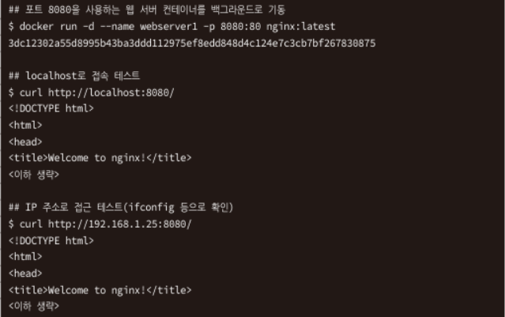  

## 4.3. AP컨테이너와 DB컨테이너의 연동 예

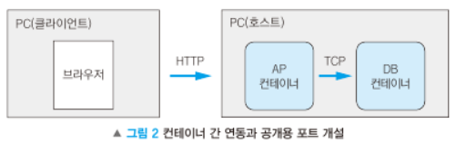  

### 4.3.1. 컨테이너 네트워크 작성

컨테이너 간 통신을 위한 전용 네트워크 `apl-net`생성

`docker network create apl-net`

### 4.3.2. mysql 서버 기동

mysql 공식 이미지는 컨테이너 기동시 환경변수를 통해 설정 정보를 전달받음. 

컨테이너 API: 환경 변수를 사용하도록 컨테이너를 개발하는 것. 이미지의 재사용성이 좋아짐. 

`-e` 옵션으로 환경변수를 지정할 수 있음.

ex)

`docker run -d --name mysql --network apl-net -e MYSQL_ROOT_PASSWORD=qwerty mysql:5.7`

### 4.3.3. 애플리케이션 컨테이너 개발

php 애플리케이션을 만들고 빌드하기. 다음과 같이 도커파일을 작성

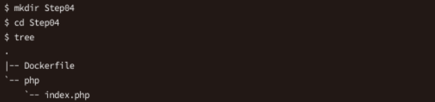  

### 4.3.4. 컨테이너 이미지 빌드

`docker build -t php-apl:0.1 .`

이미지 출력

`docker images`

### 4.3.5. 컨테이너 실행

`-d`: 컨테이너를 백그라운드로 기동

`--name 컨테이너명`: 컨테이너에 이름 부여

`--network`: 접속하는 컨테이너 네트워크 지정

`-p 공개포트번호:컨테이너포트번호`: 컨테이너의 포트번호를 호스트의 IP주소의 포트번호로 매핑. 여러 개 기술 가능

`e 환경변수=설정값`: 컨테이너 안에 환경변수를 지정. 여러 개 기술 가능

API 서버 컨테이너 가동: `docker run -d --name php --network apl-net -p 8080:80 -e MYSQL_USER=root -e MYSQL_PASSWORD=qwerty php-apl:0.1`

웹 서버 접속 로그는 `docker logs 컨테이너명 | 컨테이너ID`로 조회 가능

정리: mysql 이미지를 이용하고 환경변수를 설정해서 컨테이너를 기동했다. 데이터베이스에 접속하는 애플리케이션은 php공식 이미지를 사용했다. 동일한 컨테이너 네트워크를 사용해서 두 컨테이너를 연동했고, 포트포워딩을 설정하여 호스트의 IP주소로 애플리케이션을 공개했다. 

## 4.4. 마무리

* 컨테이너 강 연동으로 network사용
* 컨테이너는 기본적으로 bridge 컨테이너 네트워크에 연결
* `docker network create 이름`으로 컨테이너 네트워크 생성 가능. 컨테이너 기동 시 `--network`옵션으로 선택 가능
* 전용 컨테이너 네트워크를 사용하면 다른 네트워크의 컨테이너와 통신할 수 없음
* 컨테이너의 포트를 호스트의 IP주소를 통해 공개하기 위해 `-p`옵션 사용

# 5. 컨테이너 API