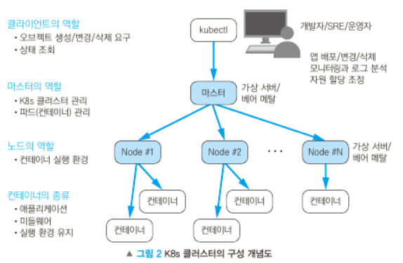

쿠버네티스 용어 -> 3.3
쿠버네티스 파드, 노드, 컨테이너 차이 -> [https://kubernetes.io/ko/docs/tutorials/kubernetes-basics/explore/explore-intro/](https://kubernetes.io/ko/docs/tutorials/kubernetes-basics/explore/explore-intro/)

# 1. 쿠버네티스란?

> # 컨테이너를 쓰는 이유?
> ## 결론
> * 현재 지속적 통합(CI)과 지속적 배포(CD)는 점점 중요해지고 있음 
> * 새로운 기능과 서비스를 빠르고 안정적으로 제공해야 함
> * 컨테이너 기술은 이런 요구사항에 효과적인 대안을 제시함
> 
> ## 적당한 배경
> * 개발자는 오픈 소스를 이용하여 짧은 시간안에 고품질 앱을 만들어야 함
> * 그러나 오픈 소스는 버전이 계속 바뀜
> * 환경 차이는 생산성을 떨어뜨림
> * 이런 상황에서 컨테이너 기술이 빛을 발한다. **불변 실행환경**을 만들어줌
> 
> ## 불변성
> * 개발자간 테스트와 운영 환경 차이를 없애고, 정식 서비스를 안정적으로 배포하게 함
> * 엔드포인트까지 확장 가능

## 1.1. 쿠버네티스 개요

쿠버네티스는 다음과 같은 기능을 제공한다. 
> 배포 계획에 맞춰 신속하게 배포
> * 컨테이너 개수, CPU 사용률, 메모리 사용량을 설정 가능 
> * 저장 공간, 네트워크 접근 제어, 로드밸런싱 기능 설정
>
> 가동 중인 앱을 스케일 업/다운 가능
> * 요청이 많을 때는 컨테이너 수를 늘려 처리 능력을 높임
> * 요청이 적을 때는 컨테이너 수를 줄여 자원 점유율이나 요금을 줄임
> 무정지 앱 업글
> 하드웨어 가동률을 높여 자원 낭비를 줄임

쿠버네티스의 특징
> 다양한 환경에서 쿠버네티스 사용 가능(퍼블릭, 프라이빗, 멀티, 하이브리드 클라우드, 온프레미스)
> 높은 유연성과 확장성
> * 마이크로 서비스 앱에 최적화 
> * 느슨한 결합 및 유연성
> * 다양한 스펙의 서버가 존재하는 클러스터에 사용 가능
> * 서버의 정지, 추가, 제거 용이
> * 로드밸런서의 동적 프로비저닝
> * 퍼블릭 클라우드 API와 연동한 쿠버네티스 조작

고가용성과 성능 관리
> * 서버 정지 시 앱 재배포 자동화
> * 앱 이상 종료시 자동 재가동
> * 필요한 인스턴스 개수 유지
> * 높은 부하에서 자동 스케일

## 1.4. 쿠버네티스가 해결하는 과제

* 애플리케이션의 빈번한 출시
* 무정지 서비스
* 초기 비용절감, 비지니스 상황에 맞게 규모 조정
* 외부 서비스 연동
* 개발환경 운영환경 분리
* 온프레미스와 클라우드 위에 구축
* 앱 중심의 오케스트레이션
* 특정 기업에 종속되지 않은 기술 표준
* 서버 가동률 높이기

## 1.5. 쿠버네티스 아키텍쳐

클러스터 관리를 담당하는 마스터(마스터 노드)와 컨테이너화된 애플리케이션을 실제로 실행하는 노드(워커 노드)라는 단 두 종류의 서버로 구성됨.

  

마스터: kubectl과 같은 API 클라이언트로부터 요청을 받아 앱의 배포, 스케일 업/다운, 컨테이너의 버전 업 등 요구를 처리. 마스터는 쿠버네티스 *클러스터의 단일 장애점이 되지 않도록 다중화 가능*

유저의 요청이 늘어나 처리 능력을 늘려야 하는 경우 기본적으로 컨테이너 수를 늘리면 되지만, 노드 수를 늘려야 할 때도 존재.

## 1.6 마무리

* 쿠버네티스는 대규모 유저 요청을 받아들이는 서비스의 백엔드에 적합한 플랫폼으로서 CI/CD에 적합
* 퍼블릭 클라우드와 온프레미스에서 같은 방식으로 사용 가능
* 컨테이너 기술을 통해 앱, 서버 인프라를 분리하여 변화 대응에 유연성과 확장성을 가짐
* CNCF(클라우드 네이티브)는 많은 지지를 받음
* 주요 퍼블릭 클라우드 업체가 쿠버네티스 관리 서비스를 제공중. on pre로 쉽게 이동 가능
* 쿠버네티스 아키텍쳐는 마스터와 노드로 구성. 마스터는 노드를 제어하고 노드에서 컨테이너가 돌아감

***

# 컨테이너의 이해

## 2.1. 컨테이너를 사용하는 이유

> 인프라 사용률 향상
> * 하나의 물리 서버나 가상 서버 위에서 여러 컨테이너를 돌릴 수 있음
> * CPU, 메모리 효율 향상
> 빠른 가동 시간
> * 컨테이너 가동 시간은 가상 서버나 물리 서버의 가동 시간보다 빠름 
> * 운영체제, 앱, 미들웨어 등 다양한 이미지를 쉽게 얻을 수 있음
> * 설치 작업, 설정 작업이 줄어듦
> * 네트워크, 볼륨을 *소프트웨어 정의 오브젝트*로 작성 가능
> 불변 실행 환경
> * 애플리케이션 실행에 필요한 소프트웨어를 모두 포함하여 컨테이너 작성 가능
> * 컨테이너를 조합하여 시스템을 구성함으로써 특정 서버 환경에 대한 종속성을 배제 가능
> * 개발 환경과 운영 환경 차이를 줄일 수 있음

## 2.2. 가상 서버와 컨테이너의 차이

가상 서버: 소프트웨어를 사용하여 하드웨어를 공유하는 형태. 하나의 머신에 여러 가상 서버를 가동 가능

컨테이너: 하나의 리눅스 프로세스가 마치 전용 서버에서 동작하고 있는 것 같은 분리 상태를 제작. 리눅스 커널의 네임스페이스와 컨트롤 그룹이라는 기술을 기반으로 함

  

  
 1](../images/16667854da3548d5b1da5e2265c2110571315f3feec88c37f066538917c1bc32.png)  
## 2.3. 도커의 아키텍쳐

리눅스 커널이 제공하는 기능을 활용하면 도커가 아니라 자체적인 컨테이너를 만드는 것도 가능하다. 그러나 공유가 어렵고 재사용이 힘들다.

도커는 생산성을 높이기 위해 작성, 이동, 실행 기능을 지원한다. 이런 기능을 제공하는 도커는 도커 데몬 서버와 클라이언트인 도커 커맨드, 그리고 이미지 보관 장소인 레지스트리로 구성된다. 

  

### 2.3.1. 도커 데몬

도커 데몬: 클라이언트인 도커 커맨드의 명령을 받아 도커 오브젝트인 이미지, 컨테이너, 볼륨, 네트워크 등을 관리. 네트워크 너머의 원격 클라이언트로부터 요청을 받는 것도 가능.

### 2.3.2. 도커 클라이언트

도커 커맨드

* docker build: 베이스 이미지에 기능을 추가하여 새로운 이미지를 만들 때 사용한다. 
* docker pull: 레지스트리에서 이미지를 로컬에 다운로드 할 때 사용한다. 
* docker run: 이미지를 바탕으로 컨테이너를 실행한다. 

### 2.3.3. 이미지

이미지: 읽기 전용인 컨테이너의 템플릿

컨테이너를 가동하기 위한 실행 파일과 설정 파일의 묶음. 컨테이너를 실행하면 이미지에 담긴 미들웨어나 앱이 설정에 따라 가동. 도커 허브에는 DB, web server, app 등 다양한 이미지가 등록되어 있음. 

호스트의 로컬에 이미지가 존재하지 않는 경우, 자동으로 원격 레지스트리에서 다운받아 실행.

  

대부분의 이미지는 다른 이미지를 기반으로 만들어짐. 

  

### 2.3.4. 컨테이너

컨테이너: 리눅스의 네임스페이스나 *컨트롤 그룹*을 통해 다른 프로세스와 완전히 분리되어 실행되는 프로세스. 컨테이너는 정지된 상태로도 관리되므로 **실행 가능한 이미지의 인스턴스**라 할 수 있음.

**docker run** 명령어를 통해 이미지는 컨테이너로 변환되어 하나의 인스턴스가 됨.

컨테이너 정지 시 **docker stop**이나 **docker kill**을 이용함. 

정지 상태인 컨테이너는 **docker rm**에 의해 지워지기 전까지 가동했을 때의 실행 옵션과 로그를 간직함.

정지된 컨테이너를 재시작 시 **docker start**이용. **이때 정지 전에 할당된 IP주소가 유지되지 않음**

  

### 2.3.5. 도커 레지스트리

도커 레지스트리: 컨테이너 이미지를 보관하는 곳. 도커 허브가 기본적.

> 퍼블릭 레지스트리
> * 도커 허브
> * Quay
> 클라우드 레지스트리
> * 아마존 엘라스틱 콘테이너 레지스트리
> * 에져 컨테이너 레지스트리
> * 구글 컨테이너 레지스트리
> * IBM 클라우드 컨테이너 레지스트리

## 2.4. 레지스트리와 쿠버네티스 관계

쿠버네티스에서도 레지스트리에서 이미지를 다운받아 컨테이너 실행

* docker build로 이미지 빌드
* docker push로 이미지를 레지스트리에 등록
* kubectl 커맨드로 *메니페스트*에 기재한 오브젝트의 생성을 요청
* 메니페스트에 기재된 리포지터리로부터 컨테이너 이미지 다운로드
* 컨테이너를 *파드* 위에서 가동

(파드 설명 [https://kubernetes.io/ko/docs/concepts/workloads/pods/](https://kubernetes.io/ko/docs/concepts/workloads/pods/))

  

## 2.5. 도커와 쿠버네티스 연동

쿠버네티스는 도커를 컨테이너의 런타임 환경으로 사용. 쿠버네티스 설치 시 제일 먼저 도커를 설치해야 함.

도커 쿠버네티스 연동
  

~~이 부분은 설명이 개 그지같네요. 따로 요약 안하겠습니다.~~

## 2.6. 컨테이너를 위한 기술 표준

**리눅스 표준 규격과 리눅스 ABI(Applicaion Binary Interface)**

도커를 사용하면 다양한 리눅스 배포판 기반 컨테이너 실행 가능. 그러나 이때 커널 버전은 다 다르다. 

리눅스 배포판과 커널 버전이 달라도 동작하는 이유
* LBS(Linux Base Standard)는 소스 코드를 컴파일한 시점에서 호환성있는 머신 코드를 생성하도록 표준화되어 있다. 
* 리눅스 ABI(application binary interface)로 인해 리눅스 커널의 버전이 올라가도 *유저 공간에서* 동작하는 바이너리 레벨의 호환성은 유지된다. 

**리눅스 커널 기술**

네임스페이스(namespace): 컨테이너가 하나의 독립된 서버처럼 동작할 수 있도록 하는 리눅스 커널에 사용된 기술. 네임스페이스를 사용하면 특정 프로세스를 다른 프로세스로부터 분리시켜 같은 네임스페이스 내에서만 접근할 수 있도록 제한함

  

컨트롤 그룹(cgroup): 컨트롤 그룹은 프로세스 별 CPU시간, 메모리 용량과 같은 자원을 감시하고 제한함.

유니온 파일 시스템(unionFS): 다른 파일 시스템에서 파일이나 디렉터리를 투과적으로 겹쳐 하나의 일관적인 파일 시스템으로 사용하도록 함. 도커에서는 unionFS의 여러 구현체를 선택할 수 있음.

OCI(Open Container Initiative): 컨테이너 표준 사양 책정 단체. 

## 2.7. 마무리

* 컨테이너로 오픈소스를 효율적으로 사용하여 애플리케이션을 개발 가능, 안정적 배포
* 컨테이너를 사용하는 의의로 인프라 사용 효율 향상, 빠른 가동 시간, 불변 실행환경
* 가상 서버와 비교했을 때 컨테이너는 **경량, 빠른 가동, 이식성**의 장점을 가짐.
* 도커와 아키텍쳐는 클라이언트/서버모델을 따르고, 서버인 도커 데몬이 클라이언트인 도커 커멘드로부터 요청을 받아들임.
* 컨테이너의 이미지를 보존하는 레지스트리는 개발한 컨테이너 이미지를 쿠버네티스에서 실행하기 위한 중간 창고 역할
* 쿠버네티스 스택은 예전부터 주로 도커를 런타임 환경으로 사용했으나 CRI로 컨테이너 실행 환경에 연동하는 식으로 발전
* 컨테이너 내의 실행파일은 LBS와 ABI에 의해 실행이 보증. OCI의 업계표준을 지킴.

***

# 3. 쿠버네티스 기본

## 3.1. 아키텍쳐

쿠버네티스는 마스터와 노드로 구성

  

위 그림은 쿠버네티스 업스트림의 기본 구성. 위에서 나오는 예시는 *업스트림 쿠버네티스에서* 마스터를 포함한 모든 노드에서 동작하는 *파드*의 목록을 출력한 것.

  

  

  

  

## 3.2. 쿠버네티스 계층 구조

클라이언트 도구인 kubectl을 통해 쿠버네티스 클러스터를 조작했을 때의 구성도

  

마스터의 역할
* 쿠버네티스의 API 서버. 클라이언트의 명령을 받아 실행
* 컨테이너를 파드 단위로 스케줄링 및 삭제
* 파드의 컨트롤러 기능과 외부 리소스 관리

쿠버네티스 스케줄링: 파드를 실행할 노드를 정하는 것

마스터는 각 노드의 CPU 메모리 예약 상황, 실제 사용량 감시를 진행

## 3.3. 쿠버네티스 API 오브젝트

쿠버네티스 API: 쿠버네티스의 조작. 

커멘드 라인 유저 인터페이스 kubectl는 마스터 노드상의 kube-apiserver에게 쿠버네티스 api 규약에 맞게 기술된 목표 상태 선언서인 메니페스트를 yaml or json형식으로 전송하여 오브젝트를 만들고 바꾸고 제거하는 일을 한다. 

오브젝트: 쿠버네티스 클러스터 내부의 엔티티로서, 파드, 컨트롤러, 서비스의 인스턴스를 의미. 각 오브젝트는 메타데이터에 기술된 이름에 의해 식별. 반드시 오브젝트를 만들 때는 이름을 부여해야 함. 같은 종류의 오브젝트 이름은 하나의 네임스페이스에서 유일.

네임스페이스: 쿠버네티스 클러스터를 논리적으로 분할하여 사용하기 위해 존재하는 기능

워크로드: 오브젝트의 카테고리 . *컨트롤러*의 그룹을 의미함.

컨테이너: 쿠버네티스에서 컨테이너만을 독자적으로 실행하는 것은 불가능하고 파드 내에서 실행해야 함

파드: 컨테이너를 실행하기 위한 오브젝트. 파드 한 개 혹은 여러 개의 컨테이너를 담을 수 있음.

컨트롤러: 파드의 실행을 제어하는 오브젝트. 여러 종류의 컨트롤러가 있다. 

설정: 컨테이너 내 애플리케이션의 설정값이나 비밀번호 등의 정보는 배포된 네임스페이스로부터 취득하는 것이 좋음. 이를 저장할 수 있는 컨피그맵과 비밀번호같은 정보를 담기 위한 시크릿 오브젝트가 있음

서비스: 쿠버네티스에서의 서비스는 파드와 클라이언트를 연결하는 역할을 함. 서버 역할을 수행하는 파드가 클라이언트의 요청을 받을 수 있도록 IP주소를 취득하여 DNS에 등록

스토리지: 파드나 컨테이너는 실행 시에만 존재하는 일시적 존재. 데이터를 잃지 않기 위해 퍼시스턴트 볼륨을 사용하여 전원이 꺼져도 유지되게 해야 함. 그런데 복수의 노드에서 접속 가능한 퍼시스턴트 볼륨은 쿠버네티스 범위에 포함되지 않아 외부 스토리지 시스템을 연동해야 한다. 

## 3.4. 파드의 기본

파드의 특징
> 컨테이너 재사용 촉진
> * 파드 내부의 컨테이너는 파드의 IP 주소와 포트번호를 공유
> * 파드의 내부 컨테이너는 localhost로 서로 통신 가능
> * 파드의 내부 컨테이너는 system V 프로세스 통신이나 POSIX공유 메모리를 사용하여 서로 통신 
> * 파드의 내부 컨테이너는 파드의 볼륨을 마운트하여 파일 시스템 공유 가능
>
> 파드는 일시적: 파드는 일시적이므로 내부 컨테이너는 이미지로부터 매번 생성
>
> 파드는 컨테이너의 실행 상태 관리: 파드가 정지하면 담당 컨트롤러가 재가동 등 정해진 처리 수행. 파드 내부 컨테이너 정지시 파드가 해당 컨테이너 재시작. 내부 애플리케이션 상태 감시
>
> 파드는 초기화 전용 컨테이너를 실행: 파드에 초기화만 담당하는 컨테이너 설정 가능

## 3.5. 파드의 라이프 사이클

쿠버네티스의 트러블 슈팅 중 가장 많이 발생하는 것은 파드의 가동 실패 원인 분석. 

개인 개발 환경에서 컨테이너 이미지를 빌드하고 쿠버네티스 환경에서 배포하면 제일 먼저 경험하는 것은 컨테이너가 가동하지 않거나 재시작을 반복하는 현상. 

이때 파드의 상태가 가지는 의미를 이해해야 함.

문제 파악을 위해 kubectl get pods를 실행하면 **status 열의 정보**가 중요함. 이 필드의 정보는 쿠버네티스 API를 통해 획득.

  

## 3.6. 파드의 종료 처리

쿠버네티스는 종료 요청 시그널을 받은 컨테이너의 애플리케이션이 일정 시간 내에 종료 처리를 완료하고 정상 종료하도록 요구

풀아웃: 운영 중 애플리케이션을 가동 중 업데이트하는 기능. 이 기능을 담당하는 컨트롤러는 가동중인 애플리케이션에 종료 요청을 보내고 유예시간까지 종료를 기다림. 늦으면 강제종료.

강재 종료되면 데이터 증발. 따라서 **메모리 상 데이터를 퍼시스턴트 볼륨에 보존하거나, db와의 세션을 종료하는 종료 처리 필요**

종료 처리 흐름
> 사용자가 kubectl delete pod를 실행하면 종료 처리 시작. 유예 기간 30초
> 
> kubectl get god의 status는 Terminating으로 표시
> 
> 세 작업 동시 진행 
> * 파드의 Prestop hook이 정의되어 있으면 파드 내에서 호출. 유예 기간을 넘으면 prestop hook이 실행되도 메인 프로세스에 SIGTERM이 보내지며 2초후 SIGKILL로 강제 종료
> * prestop hook이 정의되지 않는다면 바로 종료
> * 파드가 서비스의 엔드포인트 목록에서 제거되며 로드밸런서 목록에도 제거
> 
> 유예 시간을 넘어서서 파드 내 프로세스가 살아있으면 강제종료
> 
> 제거 대상 안보임

## 3.7. 클러스터 네트워크

클러스터 네트워크: 쿠버네티스 클러스터 내 사용되는 네트워크. 이 네트워크 상 IP주소를 부여받고 다른 노드에 있는 파드와 서로 통신

서비스의 IP주소나 포트번호를 쿠버네티스 클러스터 외부 네트워크에서 접근하게 하려면 서비스 타임을 NodePort 혹은 LoadBalancer로 설정하거나 인그레스를 함께 사용하면 됨. 

노드가 접속하는 네트워크랑 혼동이 우려되는 경우 여기서는 파드 네트워크라 함

Flannel: 네트워킹 기능만 갖추고 있고 접근 제어 기능은 제공하지 않음

Callco: 노드 간 파드 통신에 더해 네트워크 접근 제어 기능 제공

## 3.8. 서비스의 기본

  

쿠버네티스의 서비스: 클라이언트 요청을 파드에 전달. 이런 서비스가 필요한 이유는 파드의 IP주소가 바뀌기 때문. 따라서 서비스가 가지는 대표 IP를 이용해서 파드에 접속해야 함. 

> 1. 서비스는 로드벨런서의 역할을 가지며, 클라이언트 요청을 받기 위한 IP 주소 획득
> 2. 서비스의 이름은 내부 DNS에 등록되므로 클라이언트는 서비스의 이름만으로 서비스의 IP주소 획득 가능
> 3. 서비스는 *실렉터*에 지정된 라벨과 일치하는 파드 중 하나에게 요청 전달
> 4. 서비스가 만들어지고 나서 가동된 파드의 컨테이너에는 서비스에 대한 정보가 담긴 환경 변수가 자동으로 설정
> 5. 서비스에는 네 종류의 서비스 타입이 있음. 클라이언트의 범위를 쿠버네티스 클러스터 내부로 한정할지, 외부로 확장할지, 클러스터 외부의 IP주소에 전송할지 설정

파드는 가동될 때 라벨이나 IP주소를 포함한 자신의 오브젝트 정보를 마스터노드와 etcd에 등록. 

대표 IP 주소: 서비스는 파드의 그룹을 대표하여 클라이언트 요청을 받기 위해 대표 IP 주소를 가짐

부하분산: 서비스의 대표 IP주소에 도착한 요청은 실렉터의 라벨과 일치하는 파드에 전송. 

이름 해결: 서비스는 IP 주소와 서비스명을 쿠버네티스 클러스터의 내부 DNS에 등록

환경 변수: 서비스가 만들어지고 나서 생성되는 파드의 컨테이너에는 환경 변수가 설정

서비스 타입: 서비스를 설정할 때는 해당 서비스를 이용하는 클러스터를 고려하여 서비스 타입을 지정해야 함

어퍼니티: 기본적으로 부하 분산에 사용되는 알고리즘은 랜덤. 이를 정리하고 싶을 때는 sessionAffinity 항목에 ClientIP를 설정해야 함

실렉터와 라벨: 서비스에 도달한 요청 트ㅐ픽이 파드에 전송될 때 실렉터와 라벨을 참조